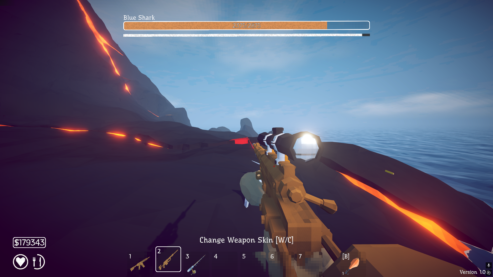

# Boss HP Text

A BepInEx plugin for [How to Fish](https://store.steampowered.com/app/4001890/How_to_Fish/)
that writes the boss's `current/total` HP inside the boss health bar.

The game's bar is a normalised fill — it shows you a proportion, never a number. This
puts the numbers back, centred in the bar, in the game's own font.



## How it works

`BossUI.UpdateBossHp(int curHp)` receives the current HP as a plain `int` and divides it
by the public static `BossManager.BossMaxHp` to get the fill proportion. Both numbers are
right there before they're thrown away, so the whole mod is a single Harmony postfix on
that method — no transpiler, no IL rewriting, no polling.

Three consequences worth knowing if you're modifying this:

- **The hook is change-driven, not per-frame.** `UpdateBossHp` is only called when the
  value actually changes, so rebuilding the string on every call costs nothing. There is
  no `Update` loop in this mod.
- **The label is created lazily** on the first call after it goes missing. That handles
  the HUD being destroyed and rebuilt between bosses without subscribing to any lifecycle
  events.
- **The font is borrowed** from `BossUI._bossNameText`, the boss name label above the bar.
  TextMeshPro needs a pre-baked `TMP_FontAsset` rather than a `.ttf`, so shipping our own
  would mean shipping an AssetBundle built against the game's exact Unity version. Reusing
  the game's asset is free and matches its typography automatically.

The label is parented to `_bossHealth`'s `RectTransform`. That rect spans the whole bar
regardless of `fillAmount` (which only drives the shader), so stretching to it centres the
text in the bar — and since the fill sits beneath the game's shake-and-spring transform,
the numbers inherit the damage animation.

## Building

You need the game's assemblies. They are not in this repo and must not be redistributed.

1. Copy everything from `How to Fish_Data/Managed/` into `lib/`.
   From a Windows machine with the game installed:

   ```powershell
   scp -r "C:\Program Files (x86)\Steam\steamapps\common\How to Fish\How to Fish\How to Fish_Data\Managed\*" you@linux-box:/path/to/how_to_fish/lib/
   ```

2. Build:

   ```bash
   dotnet build -c Release
   ```

`NuGet.config` is required — `BepInEx.Core` is not on nuget.org, it lives on BepInEx's own
feed. `lib/` is git-ignored, and every `<Reference>` uses `<Private>false</Private>` so the
game's DLLs never end up in the build output.

Built and tested against **Unity 6000.4.4 (Mono)**, BepInEx **5.4.23.5**, .NET SDK 8,
targeting `netstandard2.1`.

## Deploying

```bash
./deploy.sh
```

Builds and copies the DLL to the Windows game folder over SSH. Override the target
without editing the script:

```bash
WIN_HOST=you@192.168.1.51 ./deploy.sh
```

Note that Steam's install directory contains a *second* `How to Fish` folder — the game
lives at `steamapps/common/How to Fish/How to Fish/`.

## Configuration

Generated at `BepInEx/config/alexandre.howtofish.bosshptext.cfg` on first run.

| Key | Default | Meaning |
|---|---|---|
| `Enabled` | `true` | Show the numbers at all |
| `Format` | `{0}/{1}` | `{0}` is current HP, `{1}` is maximum |
| `FontSize` | `0` | Points; `0` copies the boss name label's size |
| `TextColor` | `#FFFFFF` | Hex colour of the numbers |
| `OutlineWidth` | `0.2` | `0`–`1`; the bar changes colour by boss type, so some outline keeps the text readable on both |
| `OutlineColor` | `#000000` | Hex colour of the outline |

A malformed `Format` string falls back to `cur/max` rather than blanking the label.

## Multiplayer

Client-side only. `BossManager.BossMaxHp` is a `SyncVar`, so the maximum is already
correct on every client — nothing is sent, nothing is patched on the server, and players
without the mod are unaffected.

One thing the numbers make visible: boss HP scales with lobby size.
`GetBossMaxHp` is `maxHp + maxHp × (playerCount − 1) × multiplier`, so a boss with 562 HP
solo has 1405 in a four-player game.

## Licence

MIT. The game assemblies in `lib/` are not covered by it and are not distributed here.
